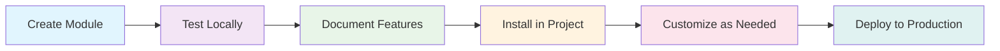

# 📚 Module Development Documentation

Welcome to the comprehensive documentation for our modular Laravel + Vue architecture! This documentation will guide you through creating reusable, full-stack feature modules that can be installed across multiple projects.

## 🎯 What Are Feature Modules?

Feature modules are **self-contained**, **reusable** packages that combine:

-   **Backend**: Laravel controllers, routes, models, services
-   **Frontend**: Vue components, services, composables
-   **Installation**: Composer and NPM packages for easy setup
-   **Extension**: Flexible architecture for project-specific customization

## 📖 Documentation Guide

### 🏗️ Module Creation

**[MODULE_CREATION_GUIDE.md](./MODULE_CREATION_GUIDE.md)**

Everything you need to know to create modules from scratch:

-   ✅ Directory structure and file organization
-   ✅ Step-by-step creation process
-   ✅ Backend package development (Laravel)
-   ✅ Frontend component development (Vue + Vuexy)
-   ✅ Installation and integration
-   ✅ Best practices and patterns

### 🔧 Module Extension

**[MODULE_EXTENSION_GUIDE.md](./MODULE_EXTENSION_GUIDE.md)**

Learn how to extend and customize existing modules:

-   ✅ Slot-based UI customization
-   ✅ Props and events for behavior modification
-   ✅ Controller inheritance patterns
-   ✅ Service extension techniques
-   ✅ Real-world extension examples

## 🚀 Getting Started

### 1. **First Time?**

Start with the [Module Creation Guide](./MODULE_CREATION_GUIDE.md) to understand the fundamentals.

### 2. **Have an Existing Module?**

Jump to the [Module Extension Guide](./MODULE_EXTENSION_GUIDE.md) to learn customization techniques.

### 3. **Want to See Examples?**

Visit the demo pages in your application:

-   **Basic Demo**: `/demo` - Shows the base module functionality
-   **Extended Demo**: `/demo/extended` - Demonstrates extension patterns

## 🎨 Architecture Overview

```
📦 Feature Module Architecture
├── 🏗️ Backend Package (Laravel)
│   ├── Controllers & Routes
│   ├── Service Providers
│   ├── Database Migrations
│   └── Configuration Files
├── 🎨 Frontend Package (Vue)
│   ├── Components (Vuexy Themed)
│   ├── Services (API Integration)
│   ├── Composables & Stores
│   └── Plugin Configuration
└── 🔌 Extension System
    ├── Slot-based UI Extension
    ├── Props-based Configuration
    ├── Event-driven Behavior
    └── Inheritance Patterns
```

## ⚡ Key Benefits

### For Developers

-   **🔄 Reusability**: Write once, use everywhere
-   **⚡ Speed**: Faster development with pre-built modules
-   **🛠️ Flexibility**: Extensive customization options
-   **📝 Documentation**: Comprehensive guides and examples

### For Projects

-   **🏗️ Modularity**: Clean, organized codebase
-   **🔧 Maintainability**: Isolated, testable components
-   **📈 Scalability**: Easy to add/remove features
-   **🎯 Consistency**: Standardized patterns across projects

## 🎯 Module Development Workflow



## 📋 Quick Reference

### Creating a New Module

```bash
# 1. Create structure
mkdir -p feature-modules/my-module/{backend,frontend}

# 2. Set up backend package
cd feature-modules/my-module/backend
# Follow MODULE_CREATION_GUIDE.md steps 2.1-2.5

# 3. Set up frontend package
cd ../frontend
# Follow MODULE_CREATION_GUIDE.md steps 3.1-3.5

# 4. Install in main project
# Follow MODULE_CREATION_GUIDE.md step 4
```

### Extending an Existing Module

```vue
<!-- Use slots for UI customization -->
<YourModule>
  <template #title>Custom Title</template>
  <template #actions="{ reload }">
    <VBtn @click="customAction">Custom Action</VBtn>
  </template>
</YourModule>
```

```php
// Extend controllers for backend functionality
class ExtendedController extends BaseController {
    public function customMethod() {
        // Your custom logic
    }
}
```

## 🛠️ Tools & Technologies

-   **Backend**: Laravel 11, Composer packages
-   **Frontend**: Vue 3, Vuexy theme, NPM packages
-   **Database**: Eloquent ORM, Migrations
-   **API**: RESTful endpoints, Sanctum authentication
-   **Styling**: Vuetify 3, Material Design icons

## 📞 Need Help?

1. **Check the guides**: Most questions are covered in our documentation
2. **Review examples**: Look at the demo module in `feature-modules/demo/`
3. **Examine extensions**: See how `ExtendedDemoTable.vue` customizes the base module
4. **Test locally**: Use the demo pages to understand the concepts

## 🔄 Contributing

When you create new modules or extension patterns:

1. **Document**: Add examples to the guides
2. **Test**: Ensure modules work across different projects
3. **Share**: Consider making useful modules available to the team
4. **Improve**: Update documentation based on real-world usage

---

**Happy Module Development!** 🚀

Build once, use everywhere, customize as needed. That's the power of our modular architecture!
